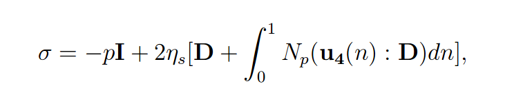
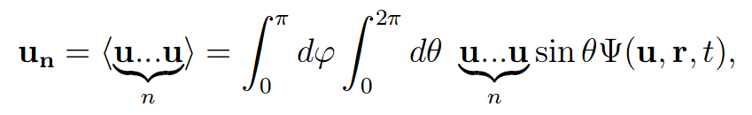
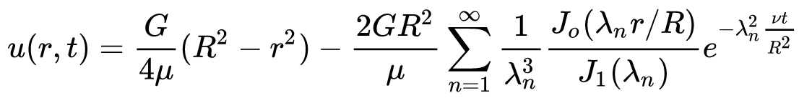

# pipeaggrot

## General description
Program combining non-Newtonian pipe flow and aggregation-orientation (AO) model. A fluid flowing 
in a pipe is thixotropic -- in this case nanocellulose suspension. Particles in suspension are 
rigid and ellipsoidal. In order to find out rheological properties of suspension, behavior of 
particles must be calculated first. To do this, program is using particle distributions instead of 
single particles in order to calculate distribution function for particle aggregations and 
orientations. From AO distribution, local stress of fluid is calculated. Basically, in order to get
stress, program is calculating 

where the fourth moment of orientation tensor is calculated from

See e.g. paper [Rheological modeling of carbon nanotube aggregate suspensions 
(W. K. A. Ma et al. 2008)
](https://sor.scitation.org/doi/abs/10.1122/1.2982932) for more detailed description of AO model. 
As a local stress of fluid is calculated, it is used to calculate a local viscosity from which 
fluid velocity is calculated in discretization points in a following way

